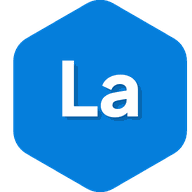
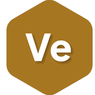
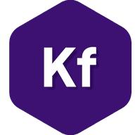

<!--
  SPDX-FileCopyrightText: 2026 Kubuno contributors
  SPDX-License-Identifier: AGPL-3.0-or-later
-->

<p align="center">
  
</p>

# Kubuno Paintsharp

[](LICENSE)


**Kubuno PaintSharp — the creative suite.**

A module for [Kubuno](https://github.com/kubuno/core), the self-hosted, libre (AGPLv3) cloud platform.

## Apps

PaintSharp bundles several creative editors, each reachable under `/paintsharp/<app>`:

| App | Path | What it does |
|---|---|---|
|  **Layer** | `/paintsharp/layer` | Raster / image editor (Photoshop-like) |
|  **Apex** | `/paintsharp/apex` | Vector editor (paths, nodes, gradients) |
|  **Vertex** | `/paintsharp/vertex` | 3D editor |
|  **Motion** | `/paintsharp/motion` | Video editor |
|  **Keyframe** | `/paintsharp/keyframe` | 2D animation |
|  **PdfWriter** | `/paintsharp/pdfwriter` | PDF editor (import & edit content) |
|  **FontEditor** | `/paintsharp/fonteditor` | Type design (glyph drawing, metrics, kerning, OTF export) |

The editors share a common UI library (EditorShell, color tools, navigator…).

### Highlights

- **Layer** — layer-based raster editing with a Photoshop-style filter library (blur, sharpen, noise, stylize… — one-click defaults plus tunable dialogs), applied as pure pixel operations with full undo.
- **Apex** — pen/node editing with gradients and boolean path operations; freehand **pencil & brush** tools with stroke stabilization, path fitting and pressure-driven calligraphic ribbons; **image tracing** (raster → editable vectors) running server-side on the [VTracer](https://github.com/visioncortex/vtracer) engine, with a live preview, full parameter control and post-trace path simplification; SVG import/export interop (including pasting SVG from the clipboard as editable shapes); vector selections can be copied as portable envelopes and pasted into other Kubuno modules (chat cards, office documents…).
- **Vertex** — 3D modeling with a professional **sculpt mode** (14 Blender-style brushes — clay, inflate, crease, grab, snake hook… — with falloff curves, pen pressure and dynamic-topology refinement) and **CSG booleans** (union / difference / intersect), plus weld, join and normal tools.
- **PdfWriter** — imports real PDFs and keeps text editable: embedded font names are matched onto the closest available family, and admin-provided fonts (drive `System/Fonts`) are both rendered on-canvas and **embedded in the exported PDF**; Acrobat-style **signatures** (draw with smoothing, type in a cursive font, or import an image with background removal — saved for reuse); offline **OCR** on scanned pages (Tesseract, fully local).
- **FontEditor** — full type-design workflow: glyph overview grid, Bézier glyph editor with vertical metrics and draggable advance width, kerning pairs and a live text preview; projects are saved as `.kbfnt` files and export to **OTF** (CFF), **TTF** (native sfnt writer, kerning included), WOFF, WOFF2, EOT and SVG font; existing `ttf`/`otf`/`woff`/`woff2`/`eot` fonts open directly as new projects.

Documents live in the Kubuno drive as regular files (`.kblayer`, `.kbvec`, `.kb3d`, `.kbvid`, `.kbanim`, `.kbpdf`, `.kbfnt`), and the editors collaborate in real time through the core's Yjs service.

## Architecture

A standalone Rust process that registers with the [core](https://github.com/kubuno/core) at startup; the core proxies its routes (`/api/v1/paintsharp/*`) and serves its runtime-loaded React frontend bundle.

- **Backend** — `src/`: Axum + SQLx (PostgreSQL, schema `paintsharp`); migrations in `migrations/`.
- **Frontend** — `frontend/`: a React bundle built to `entry.js`, consuming `@kubuno/sdk`, `@kubuno/ui` and `@kubuno/drive` from npm (provided by the host at runtime via the import map).

## Install

This module ships in the **all-in-one [Kubuno](https://github.com/kubuno/core) Docker image** (`ghcr.io/kubuno/kubuno`) — the easiest way to self-host a full Kubuno instance (core + every module). See **[kubuno/docker](https://github.com/kubuno/docker)** for `docker compose` instructions.

**Native packages** are attached to every [GitHub Release](https://github.com/kubuno/paintsharp/releases), built by CI for each platform:

| Platform | Artifact | Built by |
|---|---|---|
| Debian / Ubuntu | `kubuno-paintsharp_*.deb` | `build_deb.sh` |
| Fedora / RHEL / openSUSE | `kubuno-paintsharp-*.rpm` | `build_rpm.sh` |
| Windows | `kubuno-paintsharp-setup-*-x64.exe` (NSIS) | `build_windows.sh` |
| macOS | `kubuno-paintsharp-*.pkg` | `build_macos.sh` |

Each package installs the module into an existing Kubuno core installation and restarts the service; the core discovers it automatically.

To build this module from source, see below.

## Build

**Requirements:** Rust ≥ 1.82, Node.js ≥ 24, PostgreSQL 16.

```bash
cargo build --release                     # → target/release/kubuno-paintsharp
cd frontend && npm ci && npm run build     # → dist/{entry.js, entry.css}
bash build_deb.sh                          # → dist/kubuno-paintsharp_*.deb
```

Other platforms use the same auto-detecting scripts as CI: `build_rpm.sh` (RPM), `build_windows.sh` (NSIS installer — native on Windows via Git Bash, or cross-compiled from Linux with `cargo-xwin`) and `build_macos.sh` (macOS `.pkg`, run on a Mac; `UNIVERSAL=1` for a fat arm64 + x86_64 binary).

> Shared dependencies come from Kubuno — no `kubuno/core` checkout required:
> - **Rust** — shared crates via tagged git dependencies on `kubuno/core`.
> - **Frontend** — `@kubuno/sdk`, `@kubuno/ui`, `@kubuno/drive` from the `@kubuno` npm scope.

## Acknowledgements

- Image tracing (raster → vector, Apex's *Image trace* dialog) is powered by **[VTracer](https://github.com/visioncortex/vtracer)**, the [visioncortex](https://www.visioncortex.org/) vectorization engine (MIT/Apache-2.0). Its conversion pipeline is vendored in `src/services/vtrace.rs` on top of the `visioncortex` crate.
- OCR (PdfWriter's *Recognize text* on scanned pages, and text recognition inside traced images in Apex) uses **[Tesseract](https://github.com/tesseract-ocr/tesseract)** compiled to WebAssembly — worker, core and language models are self-hosted with the module, no public CDN involved.
- Font export builds on **[opentype.js](https://github.com/opentypejs/opentype.js)** (OTF/CFF) and **[fonteditor-core](https://github.com/kekee000/fonteditor-core)** (font-file parsing).

## License

[AGPL-3.0-or-later](LICENSE) © Kubuno contributors.
